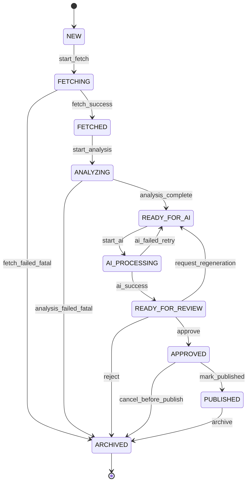

# Property Status Flow

Complete lifecycle state machine for a property record in PRO Nedvizh AI OS.

**Version:** 1.0  
**Status:** Production-ready specification (documentation only)

This document defines every allowed `status` value, valid transitions, entry/exit conditions, responsible actors, and failure handling. It complements the field definitions in [property-schema.md](./property-schema.md).

---

## Overview

The pipeline transforms a **URL** into **approved, multi-channel publishing assets**. Status is stored in the property record field `status` (enum).

`publish_status` is a separate field — it tracks distribution to Telegram, Instagram, and Reels after human approval. Do not conflate it with pipeline `status`.

### Happy-path summary

```
NEW → FETCHING → FETCHED → ANALYZING → READY_FOR_AI → AI_PROCESSING
  → READY_FOR_REVIEW → APPROVED → PUBLISHED → ARCHIVED
```

---

## Status definitions

| Status | Purpose | Typical duration |
|--------|---------|------------------|
| **NEW** | Record created; URL accepted; awaiting fetch | Seconds |
| **FETCHING** | Source page retrieval and raw HTML/media download in progress | Seconds–minutes |
| **FETCHED** | Raw listing data extracted into preliminary structure | Minutes |
| **ANALYZING** | Normalization, validation, geocoding, deduplication | Minutes |
| **READY_FOR_AI** | Structured record complete; queued for AI content generation | Minutes |
| **AI_PROCESSING** | Description and channel drafts being generated | Minutes |
| **READY_FOR_REVIEW** | AI outputs present; awaiting human or automated QC | Hours |
| **APPROVED** | QC passed; cleared for publishing | Until scheduled |
| **PUBLISHED** | Content released to one or more target channels | Terminal (active) |
| **ARCHIVED** | Removed from active pipeline; retained for history | Terminal |

---

## State diagram



---

## Detailed status reference

### NEW

**Meaning:** Property record exists in the system. URL is stored. No extraction has started.

| Attribute | Detail |
|-----------|--------|
| **Entry** | User submits URL; automation creates record |
| **Exit** | Fetch job starts |
| **Required fields** | `id`, `source_url`, `status`, `created_at`, `updated_at` |
| **Allowed operations** | Edit `source_url`, cancel (→ ARCHIVED), trigger fetch |
| **Actor** | User, intake automation |

---

### FETCHING

**Meaning:** System is downloading the listing page and associated media references.

| Attribute | Detail |
|-----------|--------|
| **Entry** | Fetch job dispatched from NEW (or retry from FETCHING after transient error) |
| **Exit** | Successful extraction → FETCHED; unrecoverable error → ARCHIVED |
| **Side effects** | Set `updated_at`; optionally set preliminary `source` if detectable early |
| **Allowed operations** | None on business fields (record locked for concurrent edits) |
| **Actor** | Fetch agent / Make scenario |

**Failure handling:**

| Failure type | Action |
|--------------|--------|
| Transient (timeout, 503) | Retry in FETCHING (max retries per policy) |
| Blocked (403, captcha) | → ARCHIVED with reason, or hold for manual intervention per ops policy |
| Invalid URL (404) | → ARCHIVED |

---

### FETCHED

**Meaning:** Raw facts and media URLs are extracted from the source. Record is populated but not yet normalized to canonical enums and units.

| Attribute | Detail |
|-----------|--------|
| **Entry** | Fetch completes successfully |
| **Exit** | Analysis job starts |
| **Required fields** | NEW minimum + `source`, `title`, `property_type`, `deal_type`, `country`, `city` |
| **Typical writes** | `description_original`, `photo_urls`, price/area/floor fields, contacts |
| **Actor** | Extraction agent |

---

### ANALYZING

**Meaning:** Normalization, validation, geocoding, unit conversion, enum mapping, and duplicate detection run against the fetched payload.

| Attribute | Detail |
|-----------|--------|
| **Entry** | Analysis job starts from FETCHED |
| **Exit** | Validation passes → READY_FOR_AI; fatal validation failure → ARCHIVED |
| **Checks** | Required field presence, price/currency consistency, coordinate pair integrity, duplicate `source_url` / fuzzy duplicate detection |
| **Actor** | Analysis / normalization agent |

**Exit to READY_FOR_AI when:**

- Canonical enums resolved (or explicitly set to `unknown` / `other` where allowed)
- Minimum location and classification fields satisfied (see property-schema stage table)
- No blocking validation errors

---

### READY_FOR_AI

**Meaning:** Structured property is complete enough for AI content generation. Record waits in queue.

| Attribute | Detail |
|-----------|--------|
| **Entry** | Analysis completes successfully |
| **Exit** | AI job starts |
| **Required fields** | FETCHED minimum + `address` or coordinates, `area_total` for residential types |
| **Allowed operations** | Manual field correction by editor, priority bump, trigger AI |
| **Actor** | Pipeline orchestrator, editor |

---

### AI_PROCESSING

**Meaning:** LLM workflows generate `description_ai`, `telegram_text`, `instagram_text`, and `reels_script`.

| Attribute | Detail |
|-----------|--------|
| **Entry** | AI job dispatched from READY_FOR_AI |
| **Exit** | Success → READY_FOR_REVIEW; retriable failure → READY_FOR_AI |
| **Side effects** | Populate AI text fields; compute preliminary `quality_score` if automated rubric runs inline |
| **Actor** | OpenRouter-backed content agents |

**Failure handling:**

| Failure type | Action |
|--------------|--------|
| Model timeout / rate limit | → READY_FOR_AI (retry) |
| Invalid output / empty drafts | → READY_FOR_AI after error logged |
| Repeated failures | Hold in READY_FOR_AI; alert ops |

---

### READY_FOR_REVIEW

**Meaning:** All AI deliverables exist. Human reviewer (or automated QC gate) evaluates accuracy and brand compliance.

| Attribute | Detail |
|-----------|--------|
| **Entry** | AI generation succeeds |
| **Exit** | Approve → APPROVED; reject → ARCHIVED; regenerate → READY_FOR_AI |
| **Required fields** | `description_ai`, `main_photo`, `photo_urls` (≥1), `telegram_text`, `instagram_text`, `reels_script` |
| **Allowed operations** | Edit any draft field, adjust `main_photo`, set `quality_score`, approve, reject, request regeneration |
| **Actor** | Human reviewer, QC automation |

**Decision outcomes:**

| Outcome | Next status | Notes |
|---------|-------------|-------|
| **Approve** | APPROVED | `quality_score` must meet threshold (default ≥ 70) |
| **Request regeneration** | READY_FOR_AI | Clears or marks stale AI fields per regen policy |
| **Reject** | ARCHIVED | Listing unsuitable, duplicate, or policy violation |

---

### APPROVED

**Meaning:** Content passed QC. Cleared for scheduling and publishing to external channels.

| Attribute | Detail |
|-----------|--------|
| **Entry** | Reviewer approves |
| **Exit** | At least one channel publish confirmed → PUBLISHED; cancel → ARCHIVED |
| **Required fields** | READY_FOR_REVIEW minimum + `quality_score`, `publish_status` |
| **Typical `publish_status`** | `ready` or `scheduled` |
| **Allowed operations** | Schedule posts, edit drafts (may require re-review per policy), publish, archive |
| **Actor** | Publishing operator, Make publish scenarios |

**Note:** Editing material copy after approval should either re-open review (→ READY_FOR_REVIEW) or follow a lightweight amendment policy defined by the team.

---

### PUBLISHED

**Meaning:** Content has been posted to at least one target channel (Telegram, Instagram, or Reels workflow initiated).

| Attribute | Detail |
|-----------|--------|
| **Entry** | Publish action confirmed for ≥1 channel |
| **Exit** | Manual archive when listing is stale or withdrawn |
| **Required fields** | APPROVED minimum + `publish_status` ∈ {`partially_published`, `published`} |
| **Side effects** | Set `publish_status` to reflect channel coverage |
| **Actor** | Publishing automation, social operator |

**`publish_status` alignment:**

| Channels live | `publish_status` |
|---------------|------------------|
| None yet | `ready` / `scheduled` (still APPROVED) |
| Some | `partially_published` |
| All target channels | `published` |

Transition to pipeline status **PUBLISHED** occurs when the first channel goes live (not when all channels complete). Full channel coverage is reflected in `publish_status`.

---

### ARCHIVED

**Meaning:** Record is inactive — failed, rejected, cancelled, delisted, or historically closed.

| Attribute | Detail |
|-----------|--------|
| **Entry** | Fatal error, rejection, cancellation, or archival from PUBLISHED |
| **Exit** | None (terminal) |
| **Allowed operations** | Read-only; optional re-import as new record with new `id` |
| **Actor** | System, reviewer, operator |

**Common archive reasons:**

- Source listing removed or URL invalid
- Duplicate of existing property
- Failed extraction after max retries
- QC rejection
- Manual cancellation before publish
- Delisted after publish window ends

---

## Transition matrix

Legitimate transitions (✓ = allowed, — = not allowed).

| From ↓ / To → | NEW | FETCHING | FETCHED | ANALYZING | READY_FOR_AI | AI_PROCESSING | READY_FOR_REVIEW | APPROVED | PUBLISHED | ARCHIVED |
|---------------|:---:|:--------:|:-------:|:---------:|:------------:|:-------------:|:----------------:|:--------:|:---------:|:--------:|
| **NEW** | — | ✓ | — | — | — | — | — | — | — | ✓ |
| **FETCHING** | — | ✓* | ✓ | — | — | — | — | — | — | ✓ |
| **FETCHED** | — | — | — | ✓ | — | — | — | — | — | ✓ |
| **ANALYZING** | — | — | — | — | ✓ | — | — | — | — | ✓ |
| **READY_FOR_AI** | — | — | — | — | — | ✓ | — | — | — | ✓ |
| **AI_PROCESSING** | — | — | — | — | ✓ | — | ✓ | — | — | ✓ |
| **READY_FOR_REVIEW** | — | — | — | — | ✓ | — | — | ✓ | — | ✓ |
| **APPROVED** | — | — | — | — | — | — | ✓† | — | ✓ | ✓ |
| **PUBLISHED** | — | — | — | — | — | — | — | — | — | ✓ |
| **ARCHIVED** | — | — | — | — | — | — | — | — | — | — |

\*Retry within FETCHING for transient errors.  
†Return to review if amendment policy requires re-approval.

---

## Events and triggers

| Event | From | To | Triggered by |
|-------|------|-----|--------------|
| `record_created` | — | NEW | URL intake |
| `start_fetch` | NEW | FETCHING | Orchestrator |
| `fetch_success` | FETCHING | FETCHED | Fetch agent |
| `fetch_failed_fatal` | FETCHING | ARCHIVED | Fetch agent |
| `start_analysis` | FETCHED | ANALYZING | Orchestrator |
| `analysis_complete` | ANALYZING | READY_FOR_AI | Analysis agent |
| `analysis_failed_fatal` | ANALYZING | ARCHIVED | Analysis agent |
| `start_ai` | READY_FOR_AI | AI_PROCESSING | Orchestrator |
| `ai_success` | AI_PROCESSING | READY_FOR_REVIEW | Content agent |
| `ai_failed_retry` | AI_PROCESSING | READY_FOR_AI | Content agent |
| `approve` | READY_FOR_REVIEW | APPROVED | Reviewer |
| `request_regeneration` | READY_FOR_REVIEW | READY_FOR_AI | Reviewer |
| `reject` | READY_FOR_REVIEW | ARCHIVED | Reviewer |
| `mark_published` | APPROVED | PUBLISHED | Publish automation |
| `cancel_before_publish` | APPROVED | ARCHIVED | Operator |
| `archive` | PUBLISHED | ARCHIVED | Operator / retention job |
| `cancel_intake` | NEW | ARCHIVED | User / operator |

Every transition must update `updated_at`. Recommended: append an audit log entry (timestamp, from, to, actor, reason) outside this schema.

---

## Concurrency and locking

| Rule | Detail |
|------|--------|
| **Single writer** | Only one automation run may hold an processing lock (FETCHING, ANALYZING, AI_PROCESSING) per `id` |
| **Editor override** | Human edits allowed in READY_FOR_AI and READY_FOR_REVIEW unless a job is actively running |
| **Idempotent transitions** | Re-applying the same transition with same target status is a no-op |
| **Stale job protection** | Jobs must verify current `status` before writing next status |

---

## SLA and queue hints (operational)

| Status | Expected max queue time | Escalation |
|--------|-------------------------|------------|
| NEW → FETCHING | Immediate | Alert if > 5 min in NEW |
| FETCHING | 10 min | Alert if stuck |
| ANALYZING | 15 min | Alert if stuck |
| READY_FOR_AI | 30 min | Alert if backlog |
| AI_PROCESSING | 15 min | Alert if stuck |
| READY_FOR_REVIEW | Business-hours dependent | Daily review digest |
| APPROVED → PUBLISHED | Per publishing calendar | Alert if scheduled slot missed |

---

## Mapping to main workflow

Alignment with the [root README](../README.md) pipeline:

| README stage | Status(es) |
|--------------|------------|
| URL input | NEW |
| Source identification | FETCHING → FETCHED |
| Information extraction | FETCHED |
| Structured property | ANALYZING → READY_FOR_AI |
| Description generation | AI_PROCESSING |
| Telegram / Instagram / Reels drafts | AI_PROCESSING → READY_FOR_REVIEW |
| Quality control | READY_FOR_REVIEW |
| Ready for publishing | APPROVED → PUBLISHED |

---

## Related documents

- [Property schema](./property-schema.md) — field types and stage requirements
- [Google Sheets property table](../google/sheets/PROPERTY_TABLE_SPEC.md) — operational tracking columns
- [Google Sheets README](../google/sheets/README.md) — spreadsheet integration scope
